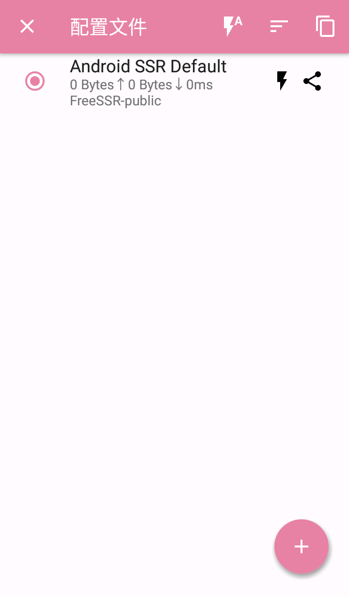
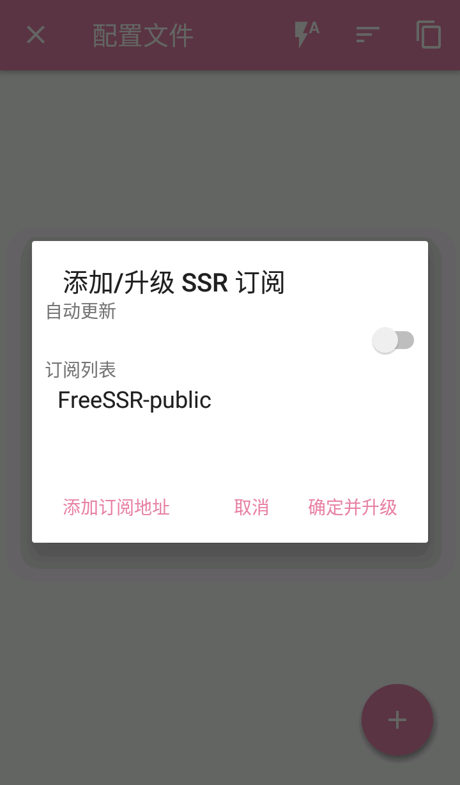
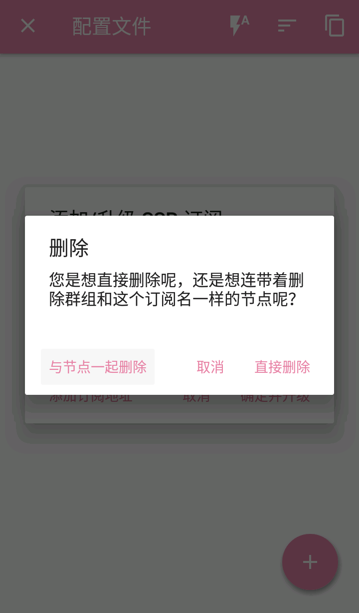
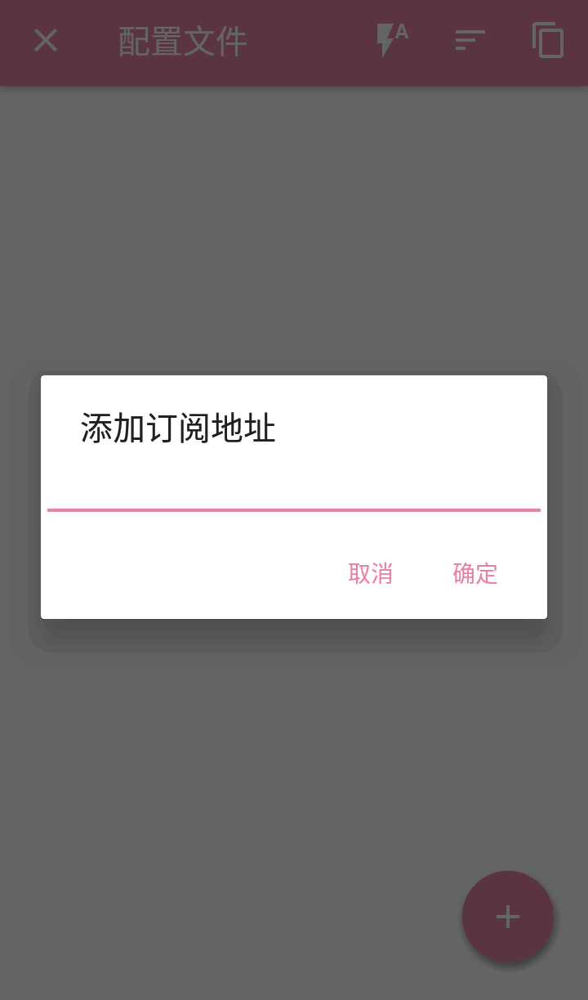
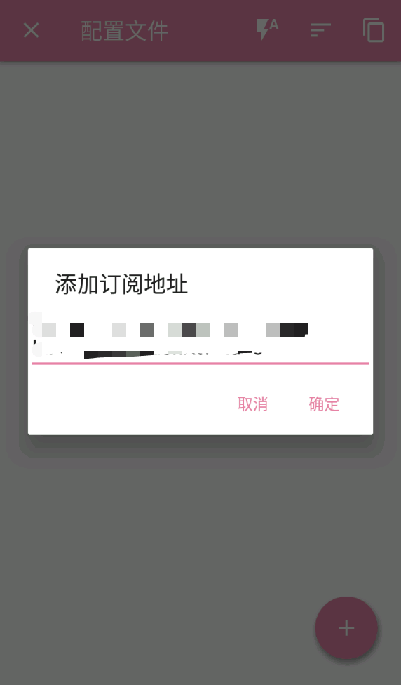
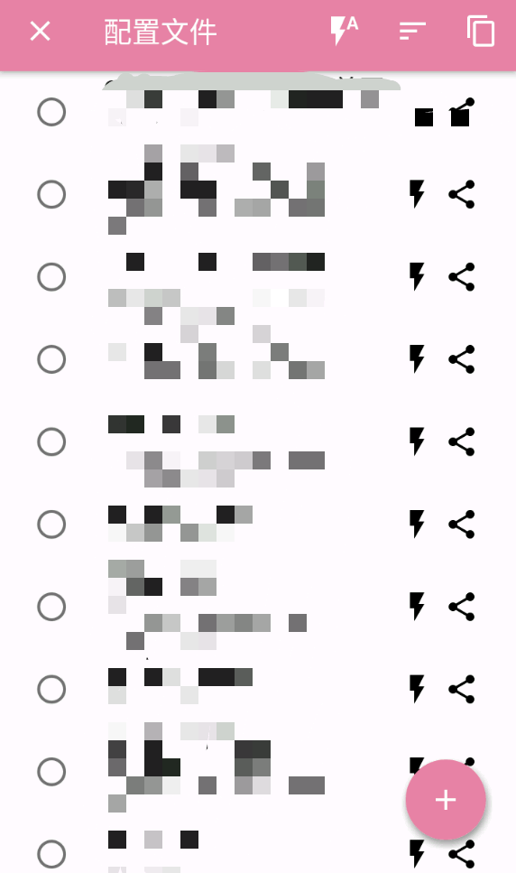
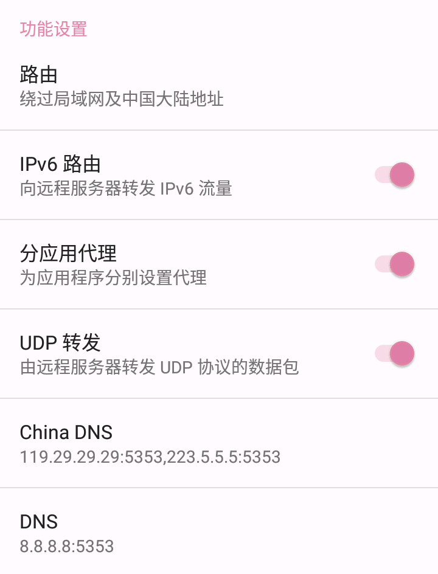
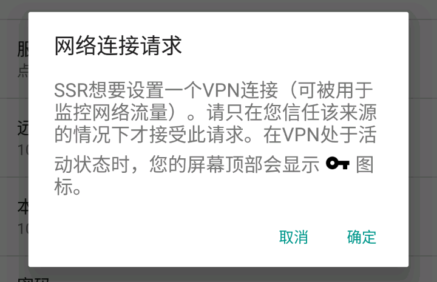

# ShadowsocksR

* `系统要求：Android 4.4 及以上`
* `软件版本：ShadowsocksR 最新版`
* `设备要求：Android Phone / Tablet`

打开 ShadowsocksR 客户端（可以在 紳士瞭望塔 的「客戶端」分區下载到客户端）。

然后点击顶部的「ShadowsocksR ⬇」区域进入节点列表。

在接入点列表页面点击底部的「+」按钮，并选择「添加/升级 SSR 订阅」。

默认有一个「FreeSSR-piblic」的无效连接信息，建议向右滑动将其去除。

再次点击接入点列表页面底部的「+」按钮，选择「添加/升级 SSR 订阅」，在订阅列表中点击「添加订阅地址」。

长按文本框空白区域，选择「粘贴」，将订阅地址粘贴到文本框中。点击「确定」

等待几秒后（具体时间取决于您的网络环境），您将会看到「墙洞」的订阅信息，勾选「自动更新」，点击「确定并升级」即可导入节点信息并自动更新。

客户端配置

导入接入点信息后，返回到主页面，然后下滑到「功能设置」功能区，打开「UDP 转发」和「IPv6 路由」，并将「路由」设置为「绕过局域网和中国大陆地址」。

滑动页面到顶部，点击右上角的纸飞机图标连接，如果是首次连接，则系统会弹出如下的提示框，请点击「确定」。

