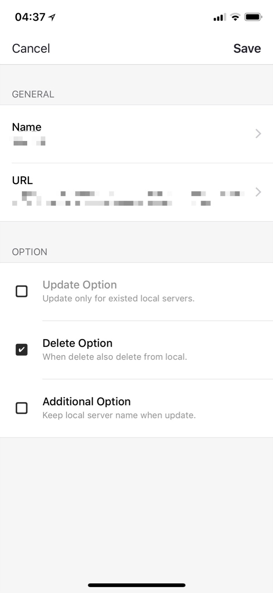
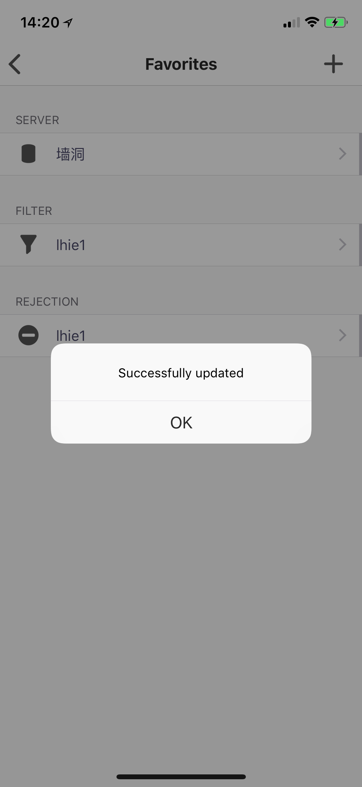

# Quantumult

* `系统要求：iOS 9 及以上`
* `软件版本：Quantumult 最新版`
* `设备要求：iPhone / iPad`

打开 Quantumult，点击底部的「Settings」进入设置页面。

点击「Favorites」 进入订阅管理页面，然后点击右上角的「+」。

在弹出的菜单中选择「Server」，在新的页面中，点击 「Name」，输入 `墙洞` 并保存，然后点击 「URL」，将订阅地址粘贴进去，并勾选下方的「Delete Option」。

添加完成后，会自动返回订阅管理页面，这时在 Server 分类下名称为「墙洞「的选项上向左轻扫，点击「Update」即可获取节点列表。

