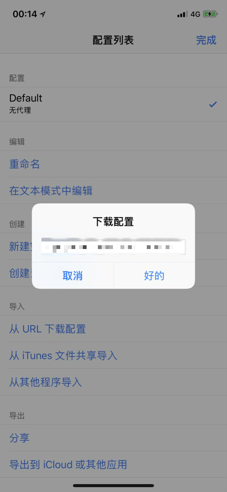
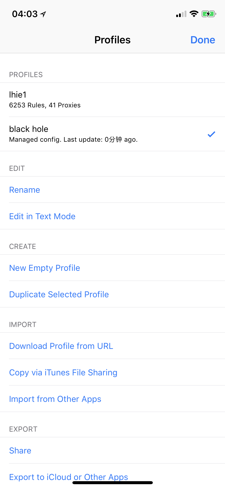

# 托管模式

* `系统要求：iOS 9 及以上`
* `软件版本：Surge 2 / 3`
* `设备要求：iPhone / iPad`

Surge 不兼容 SSR 协议，因此需要点击「✓ 一键修改为 SS 模式」才能使用托管模式。

因为兼容问题，托管模式暂不支持 Surge 3 的**新特性**，没有基于 MitM 的规则，不需要安装证书，也无法编辑。

因为协议兼容问题，在使用 Surge 时，其他客户端只可以使用「固定端口」模式。

加密：chacha20-ietf-poly1305

协议：origin

混淆：simple\_obfs\_tls

打开 Surge，点击左上角 `Default` 附近的倒三角打开配置管理，然后点击「从 URL 下载配置」。

配置列表中会出现一个名称为 `black hole` 的配置文件，并显示为托管配置，最后更新于 0 分钟前。

墙洞 的托管型配置每 24 小时自动更新一次，如果希望提前更新托管配置，只需要在对应的配置上向左清扫，选择「立即更新」。

点击右上角的「完成」，返回到主界面，即可直接启动使用（首次运行可能需要下载模块）。

