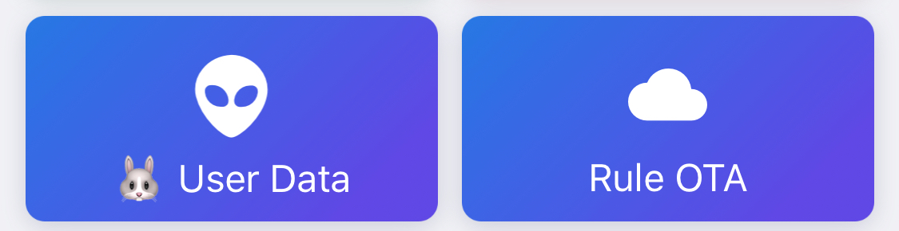
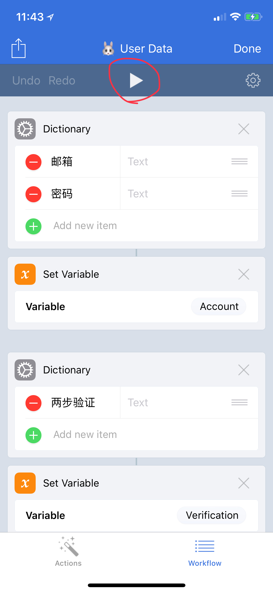

# 手动模式（Workflow）

* `系统要求：iOS 9 及以上`
* `软件版本：Surge 2 / 3`
* `设备要求：iPhone / iPad`

Surge 不兼容 SSR 协议，因此运行 Workflow 时将自动修改 加密 / 协议 / 混淆。

使用手动模式将释出做到最全面的功能及最具个人特色的规则，其中需要一些个人选择与操作（如：安装并信任证书）。

因为协议兼容问题，在使用 Surge 时，其他客户端只可以使用「固定端口」模式。

加密：chacha20-ietf-poly1305

协议：origin

混淆：simple\_obfs\_tls

因为兼容性，在使用 Surge 时，其他客户端只可以使用「固定端口」模式。

使用手册：[https://github.com/lhie1/Rules/blob/master/README.md](https://github.com/lhie1/Rules/blob/master/README.md)

到「App Store」搜索并下载「Workflow」，再到「墙洞」的「兼容软件」获取「🐰User Data」、「Rule OTA」

将「墙洞」的邮箱/密码填入点击正上方的「▶️」运行即可。

