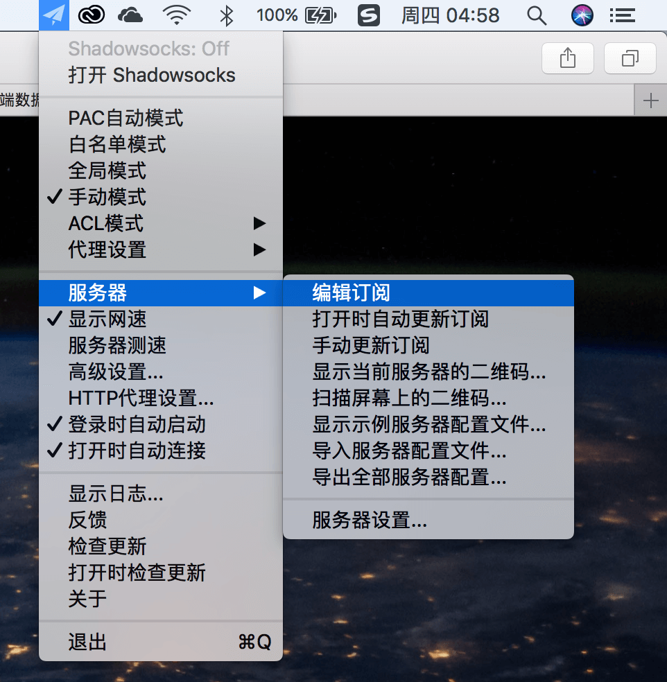
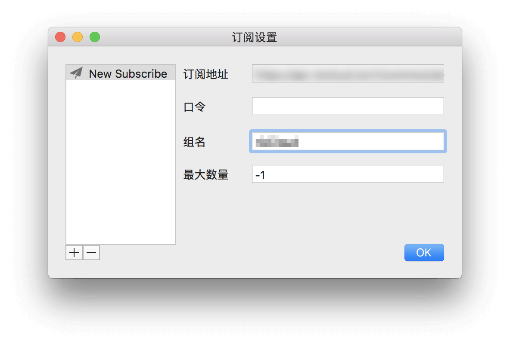
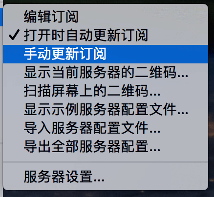
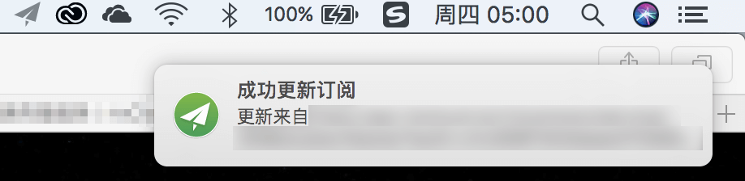
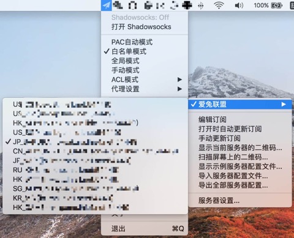

# ShadowsocksR

* `系统要求：macOS 10.5 及以上`
* `软件版本：ShadowsocksX-NG-R8`
* `设备要求：MacBook / iMac / Mac Pro`

打开 ShadowsocksR 客户端（可以在 墙洞.com 的「兼容软件」页面下载到客户端），然后右键点击右上角的小飞机图标程序，选择「服务器」中「编辑订阅」。

在弹出的窗口中找到「订阅地址」，将订阅地址粘贴于右侧的输入框中，并随意设置一个「组名」（我们推荐您将组名设置为 `墙洞` 以便于辩识）点击确定。

再次右键点击右上角的小飞机图标程序，选择「服务器」中「手动更新订阅」。

等待几秒后（具体时间取决于您的网络环境），您将会收到「成功更新订阅」的通知消息，同时查看服务器列表也可以看到「墙洞」节点。

客户端配置

在 ShadowsocksX-NG-R 应用程序的菜单中选择「打开 Shadowsocks」，并选择一个代理模式，推荐使用「PAC自动模式」或「白名单模式」。

