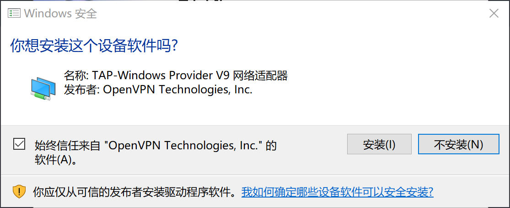

# SS-Tap（游戏/特殊）

* `系统要求：Windows 7 及以上`
* `软件版本：SSTap Beta 1.0.9.3 及以上`
* `设备要求：Windows PC / Tablet`

尽管 SS-Tap 宣称为游戏而生，但 SS / SSR 项目却并非为游戏设计的，其设计结构和很多代码实现都并不能提供足够优秀的游戏性能，墙洞 仍然建议有游戏加速需求的用户使用专业的游戏加速器，

此外，如果你有使用 BitTorrent 协议的需求（各类 BT/PT 下载），则应当避免在使用这些软件时开启 SS-Tap，否则 BitTorrent 流量将有极大可能被 SS-Tap 路由通过 墙洞 网络，而 墙洞 的条款和条件中明确指出不允许在 墙洞 网络上使用 BitTorrent 协议，否则将暂时或永久限制订阅或账户访问。

作者 Taro 宣称 SS-Tap 的代码没有备份，而储存代码的硬盘因为控制芯片损坏，永久丢失了这些代码，并决定放弃 SS-Tap 的开发，因此，SS-Tap 将可能在未来的系统更新中出现意料之外的问题或无法使用。

安装过程中将可能提示，无需担心，这是因为 SS-Tap 需要使用 OpenVPN 的 TAP 设备驱动来创建虚拟网卡以实现类似 VPN 的效果。为了 SS-Tap 能正常运行，请点击「安装」。

打开 SS-Tap，在主界面如图所示位置点击齿轮图标（SSTap 的运行需要管理员权限）

在弹出的菜单中选择「SSR 订阅」 - 「SSR 订阅管理」，在新的窗口中，将订阅地址粘贴到「URL」右边的编辑框内，然后点击「添加」。

操作完成后，关闭 SSR 订阅管理的窗口，等待几秒后（具体时间取决于您的网络环境），您将看到「墙洞」节点列表，然后在「代理」中选择所需的节点，然后根据需求在「模式」中选择所需的模式。

「墙洞」的节点均没有为游戏加速优化，暂只可达到勉强使用的状态，因此我们不对游戏加速性能提供任何保障。

