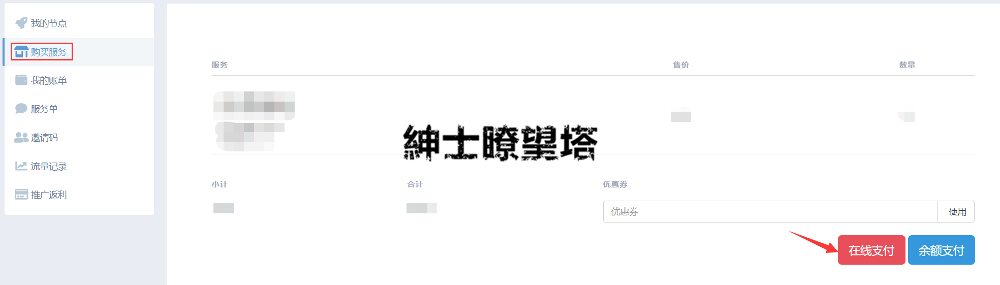
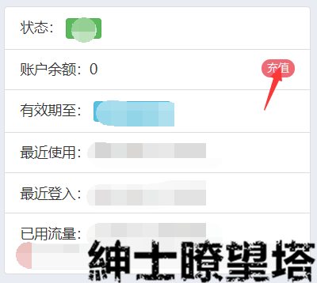
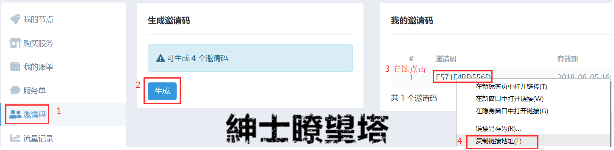

# 问题&解决

## 使用相关

### 为什么我的账号状态显示是禁用?

账号在2种情况下会显示禁用；

1. 套餐过期/使用完；此情况亲需要重新购买新的套餐；
   * 套餐过期：每个套餐都有一定的使用时长，当套餐使用到期时，服务自动禁用；
   * 套餐使用完：每个套餐都会给予账号一定的可使用流量，当可使用流量耗尽时，服务自动禁用；
2. 流量使用异常；在**24小时**内使用流量超过**25GB**，即会触发本站的流量异常保护；保护时长为12小时。

如您对禁用情况有疑问，可以联系客服人员。

## 支付相关

### Q：到期了，怎么续费？

本站支持多种在线支付方法，大致上为余额支付或者在线支付；前者会给予账号余额，由使用者选择何时开通服务；后者为系统自带开通；

#### 在线支付


支持`微信`，`QQ`，以及`支付宝`


点击`购买服务`-选择想要`购买的套餐-`选择`在线支付`

#### 余额支付/充值余额


支持`微信`与`支付宝`；


充值时请在对应的支付软件上，输入金额界面，填写备注/留言。内容为：您的账号 


充值余额是非即时充值，充值会在24小时内处理（在备注了账号信息下）！

1. 如果账号信息已经备注，请勿通过任意渠道催促管理人员！
2. 未备注时，请联系管理人员，并提交支付信息截图以及邮箱；


## 邀请相关


温馨提示：您邀请的用户将于您挂钩，请确保您邀请的用户是真正需要本站服务用户。


### 我有朋友也想加入，怎么办？

1. 本站用户界面左侧，点击`邀请码`分页-点击`生成`邀请码-`右键点击`邀请码-点击`复制链接地址`。
2. 将链接发给你要邀请的对象。


 当你邀请的对象消费时，您将获得他/她未来消费金额的 **`8%`** 作为推广奖励。


### 我邀请码用光了，怎么办？

您可以开`服务单`，向客服获取更多的邀请码；

