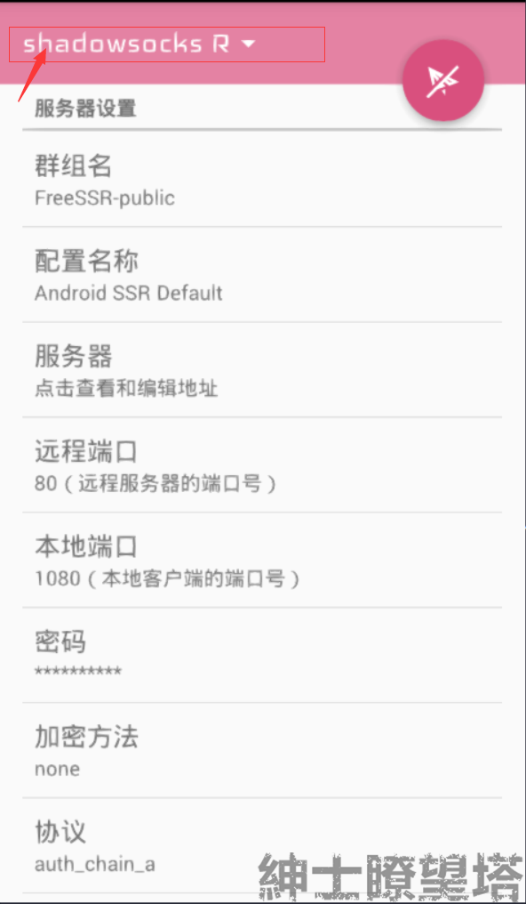
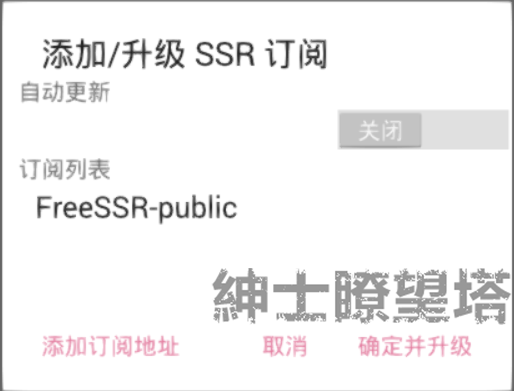
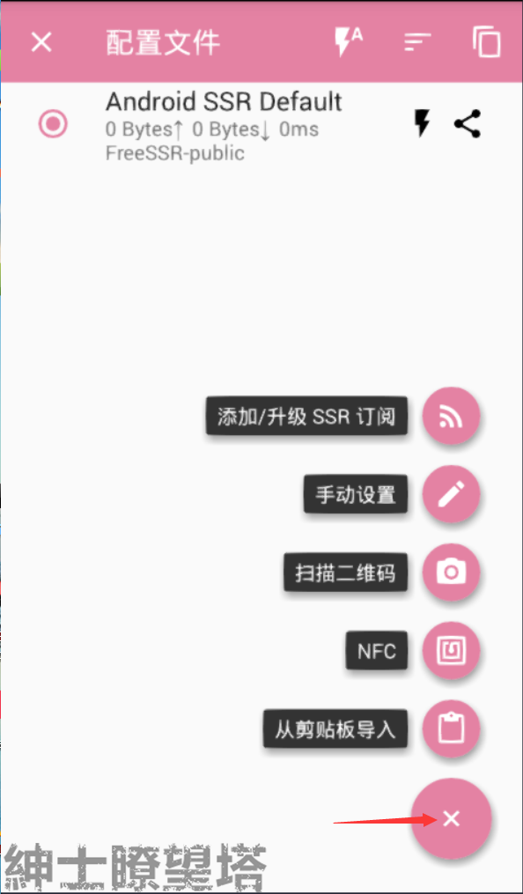
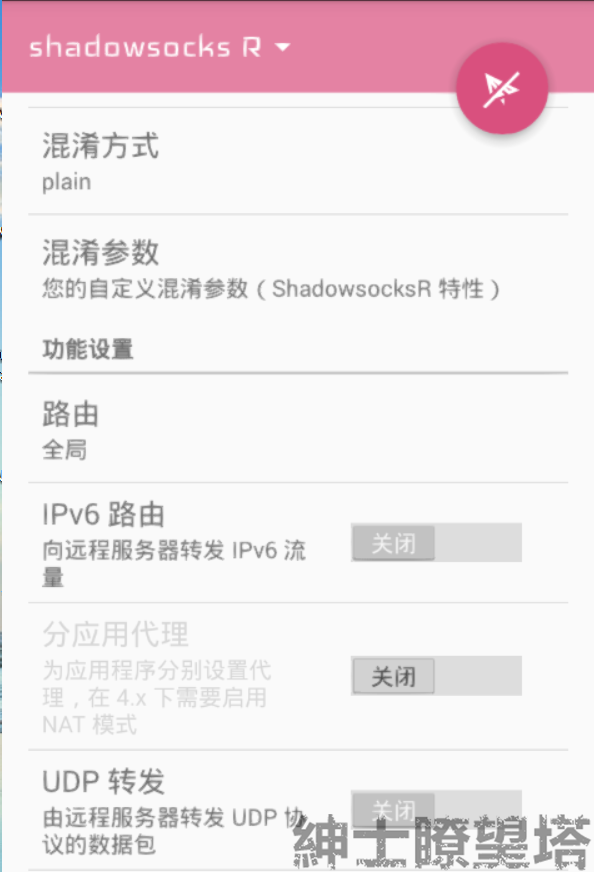

# 安卓

## 要求

* 系统要求： `因设备而异`
* 软件版本：`v3.5.4-alpha`
* 设备要求：`安卓手机 / 平板`

## 添加节点


进行此步骤前，您需要知道如何获取**节点信息**​




### 设置位置

运行软件后，点击左上角`ShadowsocksR` logo，

进去节点添加/选择界面

点击右下角 **（+）** 号，打开节点添加列表。

### 订阅链接

选择**`添加/升级SSR订阅`**

选择`添加订阅地址`，粘贴**订阅地址**，点击\[完成\]回到添加/升级SSR订阅界面

选择性勾选自动更新，最后 点击\[确定并升级\]

### 单节点一键设置

获取节点二维码/代码后，选择扫描二维码/从剪贴板导入添加。

只有一个设备时，推荐节点代码；有多个设备时，推荐节点代码

### 单节点手动设置

主界面即为手动设置界面，用户可以依次填写/选择线路信息；

## 选择节点

该界面为节点界面，用户可以选择想用的节点

## 启动代理

### 路由

#### 位置

线路设置界面（主界面）下滑至 选项 \[功能设置\] —选择\[路由\]

#### 选项

* 全局
* 绕过局域网
* 绕过中国大陆地址
* 绕过局域网及中国大陆地址
* 仅代理中国大陆无法访问的地址（推荐）
* 仅代理中国大陆地址
* 自定义ACL文件

ACL为自定义代理规则，使用前推荐先查阅



### 运行

点击界面上的被`划掉的飞机图标`运行

## 功能

### 延迟测试

本功能使用TCP（默认）测试节点延迟。该延迟为手机到服务器的请求延迟。


延迟≠网速，延迟会受到`地区距离` 以及 `网络运营商的线路`影响。


一般来说`中国-美国`延迟会在200+ms，`中国-周边国家`基本为100+ms，`中国-欧洲/加拿大`为250+ms；

注意：这里的单位为 毫秒；

