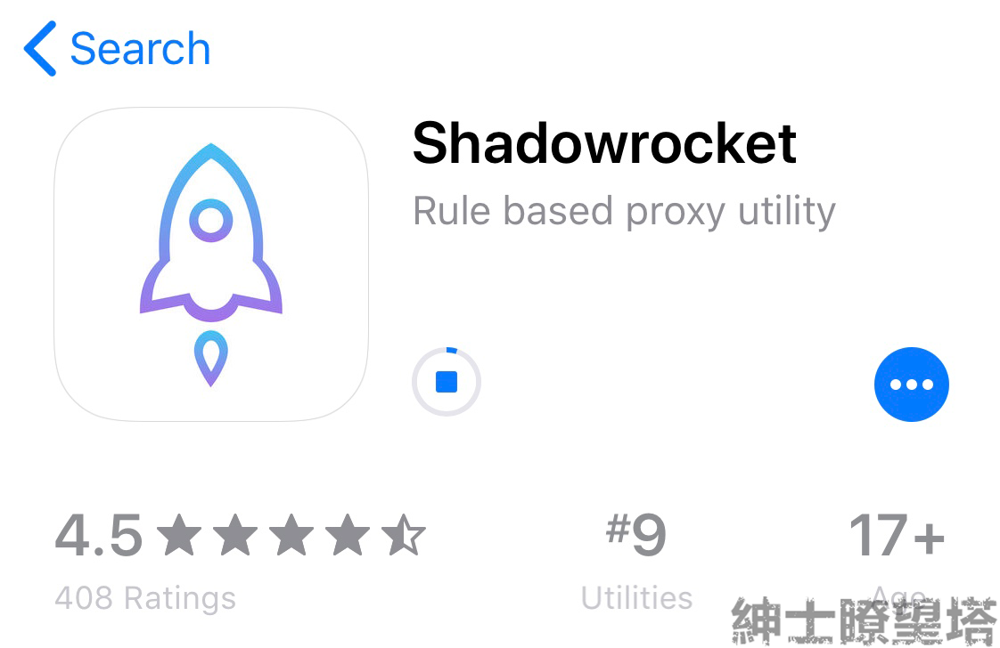
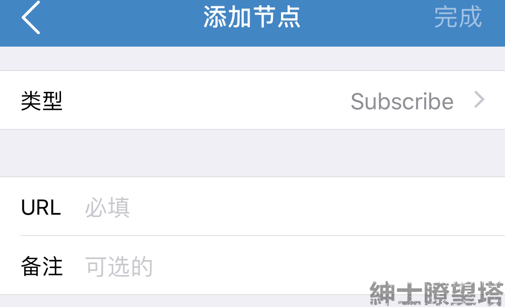
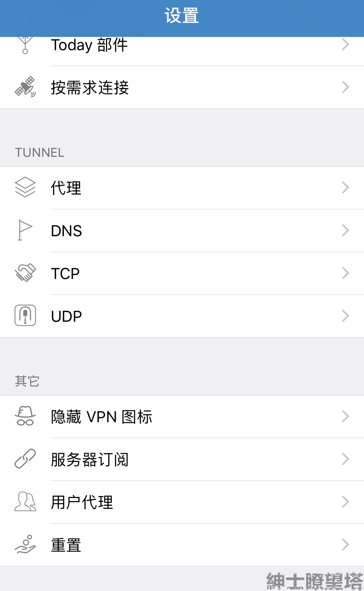
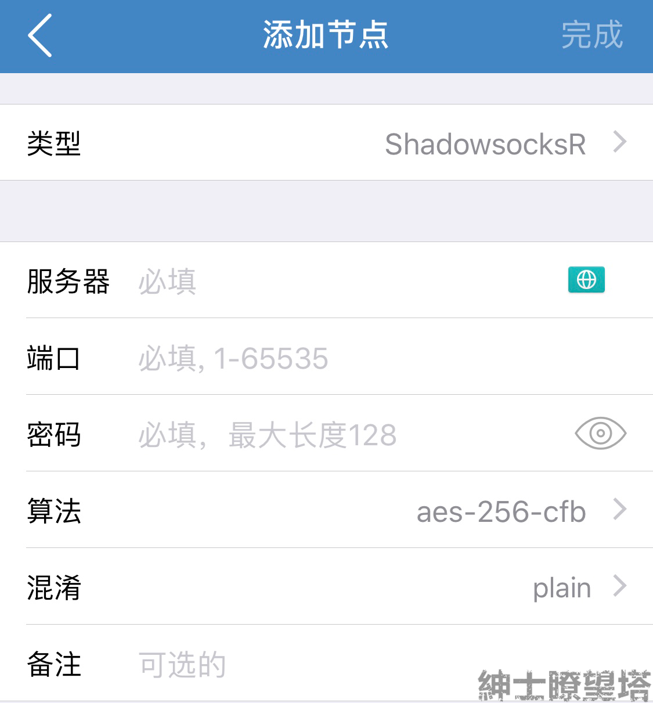

# iOS


**已付费**用户本站会在无偿分享本客户端的下载账号；\(请在[**用户中心**](http://ssr.hentaiworld.cc/)的公告中获取售后群信息并加群，账号在将会在**群公告**中标识！）


## 要求

* 系统要求：`iOS 9.0 及更新版本`
* 软件版本：`Shadowrocket 2.1.21`
* 设备要求：`iPhone，iPad / iPod `


本教程需要用户先获得[**节点设置**](https://docs.hentaiworld.cc/tutorial/settinginfo)信息！


## 软件界面

## 节点添加

### 订阅链接

点击右上方**+**号 或者 下方的**添加节点**，将类型改为`Subscribe`即可。

将**订阅地址**粘贴于URL的输入框中，点击「完成」。

进入软件的`设置`界面，在`其他`分区中找到`服务器订阅`并进入；  打开「**打开时更新**」功能

### 单节点一键设置

#### 有多台设备时

进入软件主界面后，点击软件**左上角**图标，进入扫二维码界面；

在另一设备上打开**节点二维码**。

#### 只有一台设备时

先进入官网，打开**节点二维码**并截图保存。

进入软件主界面后，点击软件**左上角**图标，进入扫二维码界面。再点击**右上角** 进入相册

选择节点二维码截图，完成设置

### 单节点手动设置

切换类型为 `ShadowsocksR`，

获取**节点设置 **并按照设置输入/选择 各选项。

## 选择节点

在软件主界面，点击想用的节点，即为改变线路

## 启动代理

### 全局路由

* 配置：既智能代理，软件会按照**配置**中的`conf`文件决定流量是否通过软件连接或者直连；（推荐）
* 代理：既全局代理，一切流量都通过软件连接；
* 直连：既关闭代理，一切流量都不通过软件链接；
* 场景：按照不同网络环境，是否运行软件并决定使用哪一代理方式。（改选项需要自行设置）

点击主界面的开关按钮，开启软件（第一次运行，需要同意VPN添加）

## 功能

### 延迟测试

本功能使用TCP（默认）测试节点延迟。该延迟为手机到服务器的请求延迟。


延迟≠网速，延迟会受到`地区距离` 以及 `网络运营商的线路`影响。


一般来说`中国-美国`延迟会在200+ms，`中国-周边国家`基本为100+ms，`中国-欧洲/加拿大`为250+ms；

注意：这里的单位为 毫秒；

### 配置

位置在主界面底部

进入**配置界面**后，点击右上角**+**号，粘贴配置链接，最后点击下载。

链接将出现在下方的`远程文件`中，点击后出现「使用配置」选项。（第一次使用时，需要下载，之后会出现在`本地文件`，需要更新本地文件，只需要再次点击远程文件中的「使用配置」即可）

#### 配置文件

| 规则 | 去广告 | 规定代理的网站 | 规定直连的网站 | 剩余的网站 |
| --- | --- | --- | --- | --- | --- | --- | --- | --- | --- | --- |
| [黑名单过滤 + 广告](https://raw.githubusercontent.com/h2y/Shadowrocket-ADBlock-Rules/master/sr_top500_banlist_ad.conf) | 是 | top500 网站中不可直连的网站 | 中国网站 | 直连 |
| [白名单过滤 + 广告](https://raw.githubusercontent.com/h2y/Shadowrocket-ADBlock-Rules/master/sr_top500_whitelist_ad.conf) | 是 | 无 | top500 网站中可直连的网站、中国网站 | 代理 |
| [黑名单过滤](https://raw.githubusercontent.com/h2y/Shadowrocket-ADBlock-Rules/master/sr_top500_banlist.conf) | 无 | top500 网站中不可直连的网站 | 中国网站 | 直连 |
| [白名单过滤](https://raw.githubusercontent.com/h2y/Shadowrocket-ADBlock-Rules/master/sr_top500_whitelist.conf) | 无 | 无 | top500 网站中可直连的网站、中国网站 | 代理 |
| [国内外划分 + 广告](https://raw.githubusercontent.com/h2y/Shadowrocket-ADBlock-Rules/master/sr_cnip_ad.conf) | 是 | 国外所有 | 中国网站 | / |
| [国内外划分](https://raw.githubusercontent.com/h2y/Shadowrocket-ADBlock-Rules/master/sr_cnip.conf) | 无 | 国外所有 | 中国网站 | / |
| [直连去广告](https://raw.githubusercontent.com/h2y/Shadowrocket-ADBlock-Rules/master/sr_direct_banad.conf) | 是 | 无 | 全部 | / |
| [代理去广告](https://raw.githubusercontent.com/h2y/Shadowrocket-ADBlock-Rules/master/sr_proxy_banad.conf) | 是 | 全部 | 无 | / |
| [回国规则](https://raw.githubusercontent.com/h2y/Shadowrocket-ADBlock-Rules/master/sr_backcn.conf) | 无 | 中国网站 | 国外网站 | / |
| [回国规则 + 广告](https://raw.githubusercontent.com/h2y/Shadowrocket-ADBlock-Rules/master/sr_backcn_ad.conf) | 是 | 中国网站 | 国外网站 | / |

