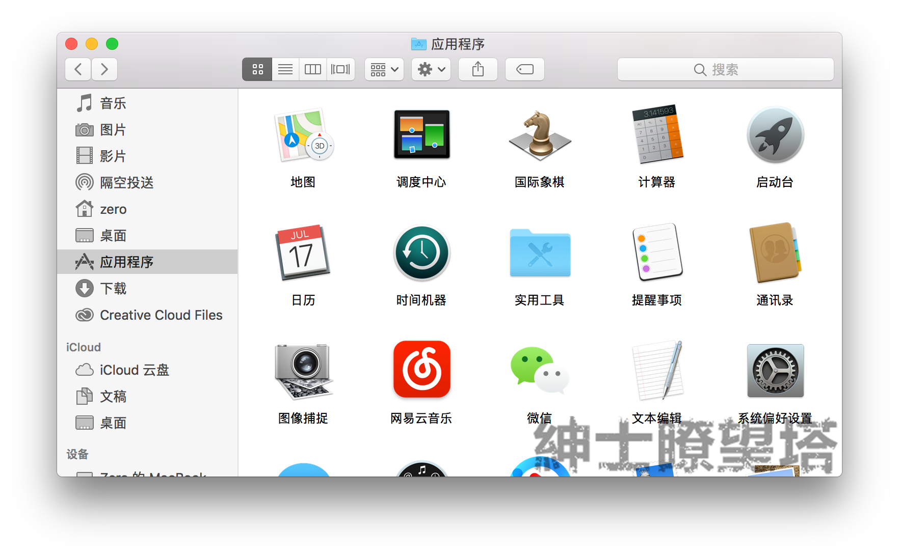
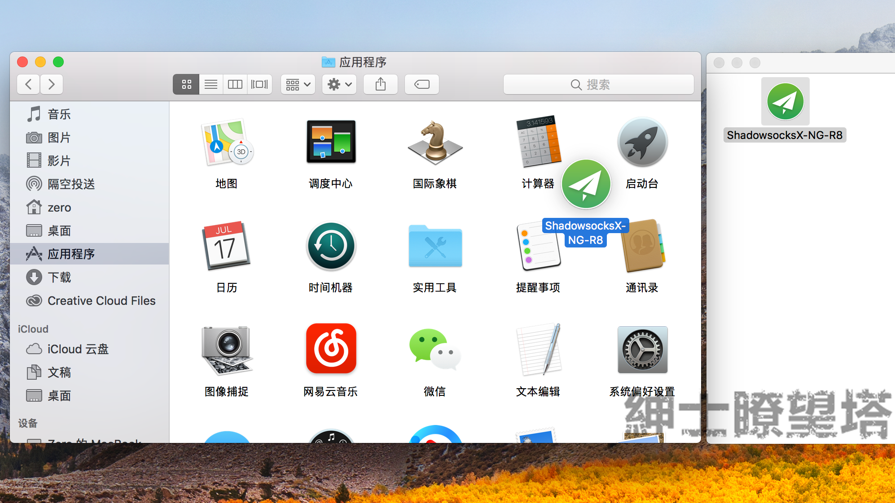
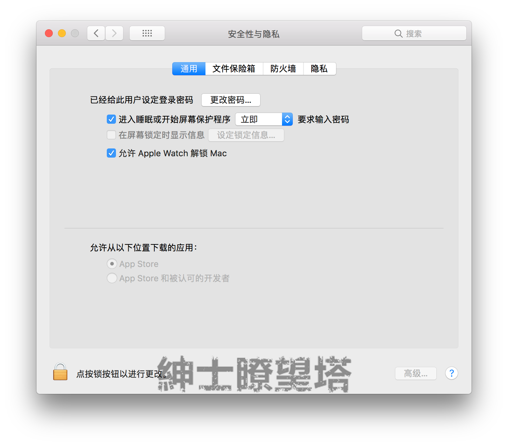
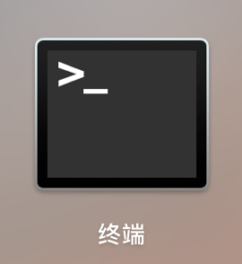
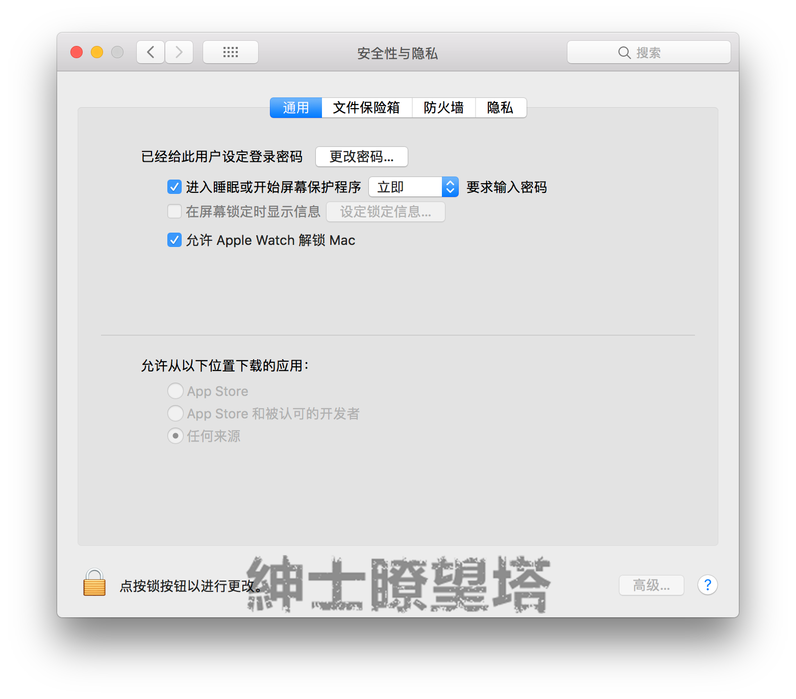
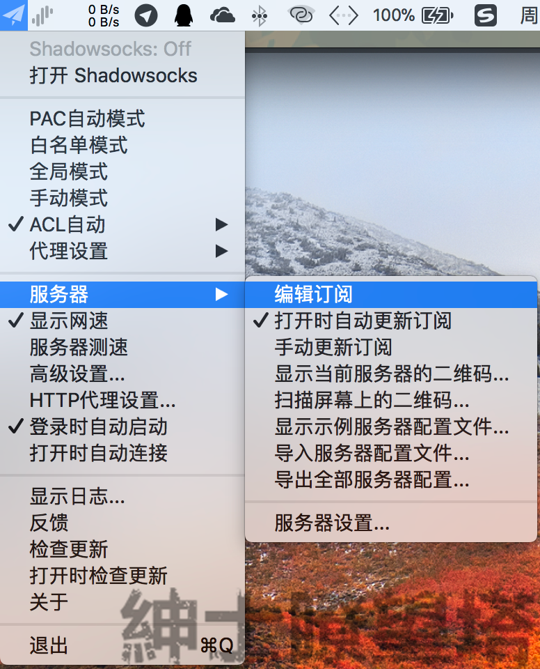
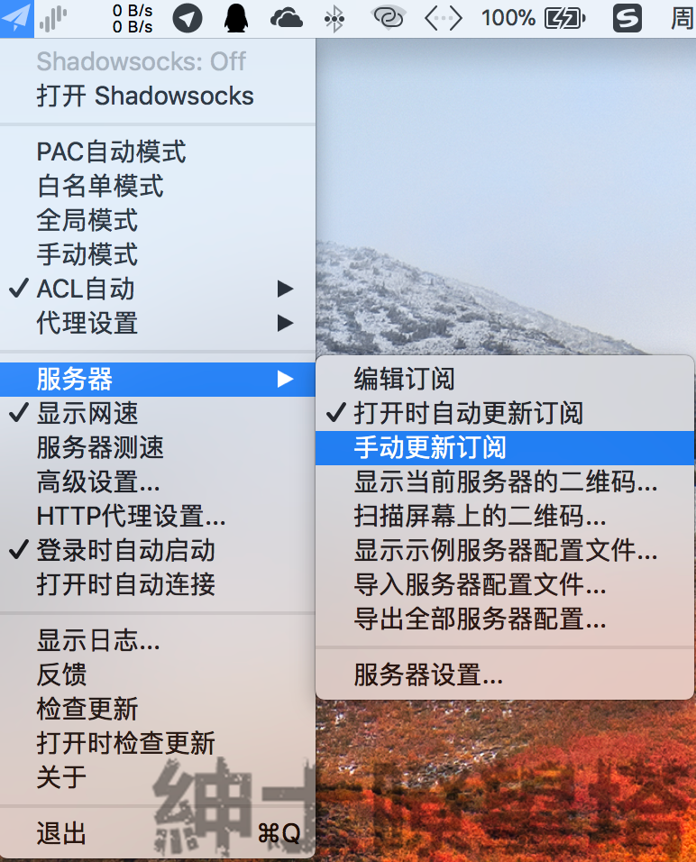
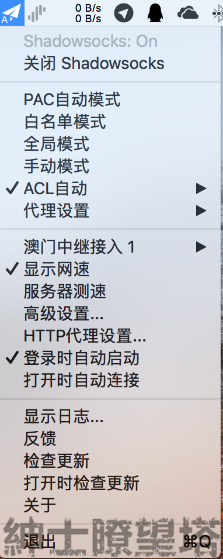
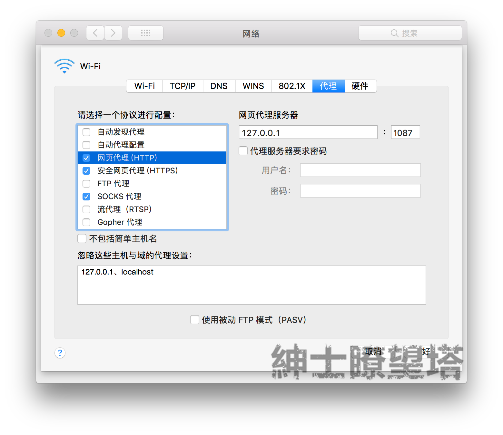

# MacOS

## 要求

* 系统要求：`MacOS 10.11及更新版本`
* 软件版本： `1.4.3-R8-build3`
* 设备要求：`Macbook` 

## 下载



## 安装

在 Finder 中双击 客户端安装包 打开宗卷，然后用 Finder 打开「应用程序」目录。



在 安装文件 的宗卷中，用鼠标将 安装文件 拖动到 Finder 的应用程序目录。



由于 安装文件 是未经 Apple 签名的应用程序，因此 MacOS 可能会阻止运行此程序。

打开「系统偏好设置」-「安全性与隐私」，可以查看到你的 macOS 可能仅允许使用来自 AppStore 或受信任开发者的应用程序。



打开「终端」。



在终端的窗口中输入如下指令，并按下回车键。

```text
sudo spctl --master-disable
```

由于申请了 sudo 权限，需要输入你当前账户的密码，在 Shell 中输入密码是不可见的，只需要输入密码后按下回车即可。

再次访问「安全性与隐私」页面，将可以看到你的 macOS 已经允许「任何来源」的应用程序运行。



## 添加节点


进行此步骤前，您需要知道如何获取**节点信息**




打开 SSX-NG-R，打开后将会在状态栏上出现一个灰色的纸飞机图标。


### 订阅链接

点击此图标，选择「服务器」-「编辑订阅」。



在新的「订阅设置」窗口中点击 `+` 号，然后将刚才复制的 rixCloud API URI 粘贴到「订阅地址」一栏上。点击「OK」

再次点击 SSX-NG-R 的图标，如图所示勾选「打开时自动更新订阅」并点击「手动更新订阅」。



如果一切顺利，将会收到通知消息提示订阅更新成功。

### 单节点一键设置


在服务器选项中 选择扫描屏幕二维码；

## 节点选择

在\[服务器分组\]中选择需要的节点。

选择所需的代理模式，然后点击「打开 Shadowsocks」即可。



推荐为PAC自动模式，

ACL自动为自定义，使用前推荐查阅



## 其他

### 为 Shell 设置代理

如果需要在终端中使用，则需要单独进行设置。

首先查看 SSX-NG-R 当前将本地代理工作在哪个端口。

在已经开启 SSX-NG-R 并启用系统代理时，打开「系统偏好设置」-「网络」，选择当前使用的网络设备，点击「高级」。

点击「代理」选项卡，其中的 HTTP / HTTPS / SOCKS 代理应当已经被勾选。我们需要查看他们的端口。



在本例中，SSX-NG-R 的 HTTP/HTTPS 代理工作在 `1087` 端口，SOCKS 5 代理工作在 `1086` 端口。

打开终端，在 Shell 中键入如下指令：

```text
export https_proxy=http://127.0.0.1:1087;export http_proxy=http://127.0.0.1:1087;export all_proxy=socks5://127.0.0.1:1086
```

此时 Shell 已经设置为通过 SSX-NG-R 进行代理，可以通过以下指令来检测：

```text
curl ip.sb
```

查看 IP 地址是否为 rixCloud 接入点的出口 IP 地址。

