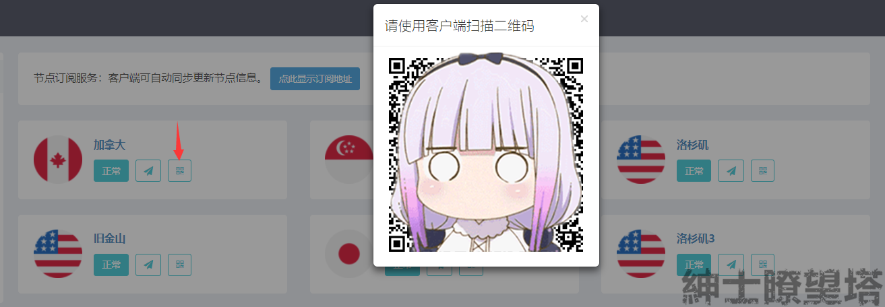
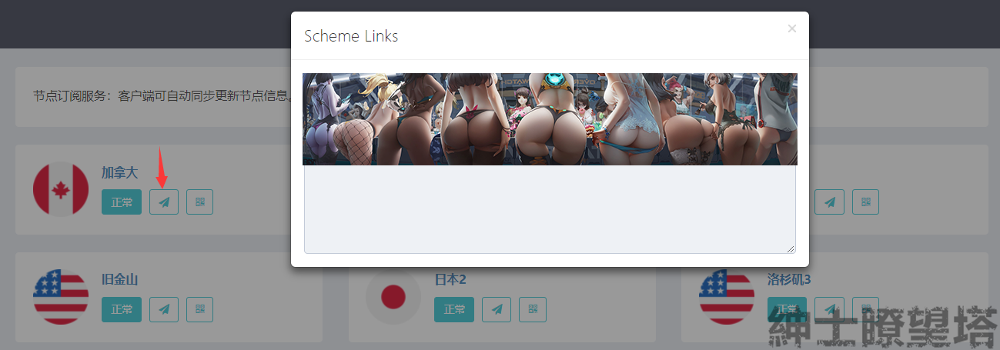
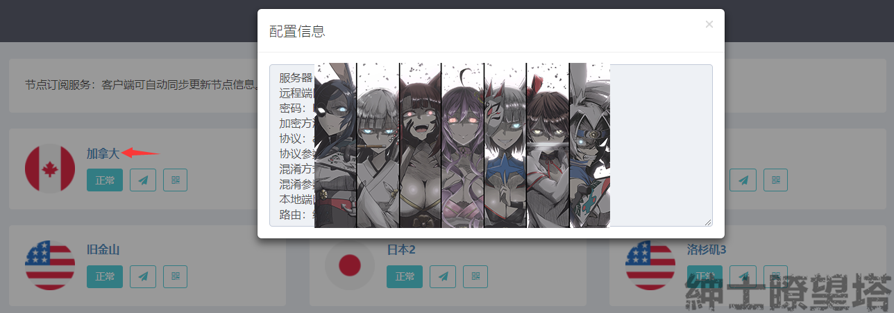

# 设置信息


请将以下**信息**妥善保管，请勿泄露给他人！


> 获取需要前往绅士瞭望塔[用户中心](https://ssr.otakuyun.com/login)

## 订阅链接（推荐）


客户端可自动同步更新节点信息


#### 评价

> * 推荐度：★★★★☆ 
> * 难易度：★★★☆
> * 时效性：★★★★☆
> * 兼容性：★★☆

#### 获取位置

## 单节点快捷设置

### 二维码


**任意**设备客户端 皆可以使用内置功能扫描二维码


#### 评价

> * 推荐度：★★★★
> * 难易度：★★★
> * 时效性：★★
> * 兼容性：★★★★★

#### 获取位置

### 设置代码


任意设备可以通过扫描粘贴板中的链接获取设置信息


#### 评价

> * 推荐度：★★★★
> * 难易度：★★☆
> * 时效性：★★
> * 兼容性：★★★★★

#### 获取位置

## 单节点手动设置


手动选择与填写，低效率，不推荐


#### 评价

> * 推荐度：★★
> * 难易度：★
> * 时效性：★★
> * 兼容性：★★★★★

#### 获取位置

