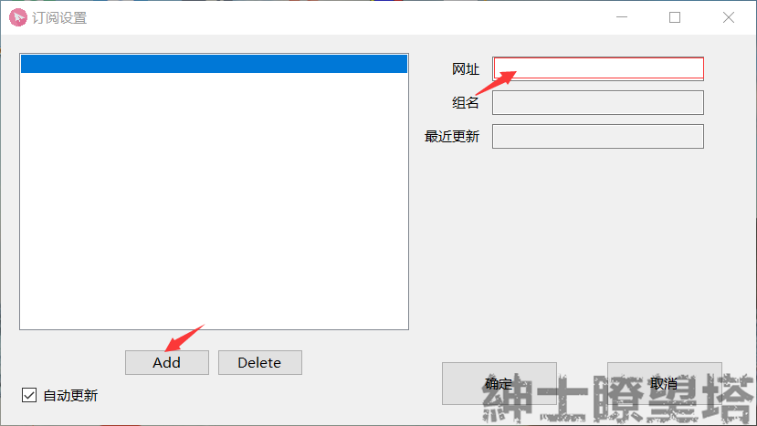
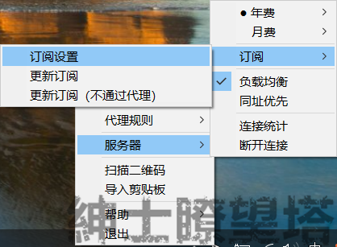
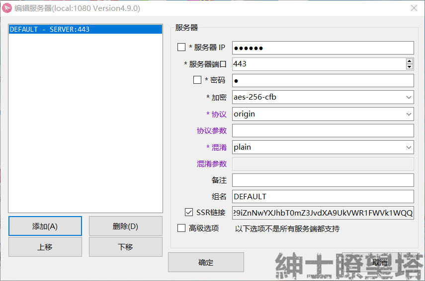
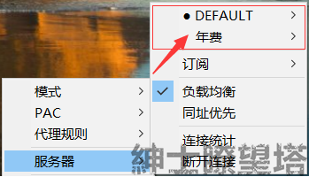
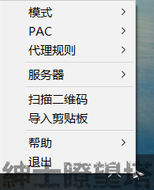

# 标准版

## 要求

* 系统要求：`Windows XP 及更新版本`
* 软件版本：`ShadowsocksR 标准版 4.9mod`
* 设备要求：`Windows 电脑 / 平板`

## 下载


 XP默认并没有安装 .NET Framework v2.0和v4.0，需要手动安装，[v4.0下载](https://download.microsoft.com/download/1/B/E/1BE39E79-7E39-46A3-96FF-047F95396215/dotNetFx40_Full_setup.exe)+ [V4.0.3更新包](https://download.microsoft.com/download/1/B/E/1BE39E79-7E39-46A3-96FF-047F95396215/dotNetFx40_Full_setup.exe)




##  添加节点


进行此步骤前，您需要知道如何获取**节点信息**




### 订阅链接

双击运行Windows标准版客户端，然后右键点击托盘栏纸飞机图标，在「服务器」选项卡中选择「订阅」— 「订阅设置」

在弹出的窗口中，点击 `Add` 按钮，将**订阅链接**粘贴于右侧的输入框中，点击「确定」

再次右键点击托盘栏纸飞机图标，在「服务器」选项卡中选择「更新订阅（不通过代理）」

等待几秒后（具体时间取决于您的网络环境），您将会收到「服务器订阅更新成功」的通知消息，同时查看服务器列表也可以看到节点。列：上图中`年费`，`月费` 标记的节点分组。

### 单节点一键设置

#### 二维码&设置代码

 双击运行Windows标准版客户端，然后右键点击托盘栏纸飞机图标，

在用户中心打开**节点二维码** 或者 复制 **节点设置代码**；

节点 `扫描二维码`或者`导入剪贴板`进行一键设置

###  单节点手动设置

 双击运行Windows标准版客户端，然后双击托盘栏纸飞机图标

出现以下界面，并依次输入/选择节点设置信息，最后点击保存。

## 选择节点

右键点击托盘栏纸飞机图标， 在「服务器」选项卡中选择「节点分组」，（订阅上面的都是节点分组），进入分组选择`节点`。

## 启动代理

 右键点击托盘栏纸飞机图标，开启菜单

### 模式

* 直连：该模式下等于关闭软件!
* 代理：**自动代理模式**，该模式会依据`PAC`以及`代理规则`智能代理需要代理的网站。（推荐）
* 全局：全部流量都走代理。

### PAC

根据`PAC`文件中的黑白地址名单来判断流量数据是代理还是直连。

按照文字提示选择PAC；

推荐：**GFWList**， 该PAC包含大部分被墙网址的代理规则；

### 代理规则

根据`IP`来判断流量数据是代理还是直连。

* 绕过局域网：局域网内IP 不走代理直连，局域网外IP 都走代理。
* 绕过局域网和大陆：访问网站的是`大陆IP`直连，访问 `非大陆IP`的网站走代理。
* 绕过局域网和非大陆：访问网站的是 `大陆IP` 走代理，访问`非大陆IP`的网站直连，这个一般是海外访问国内网站用的

## 功能

请自行摸索

