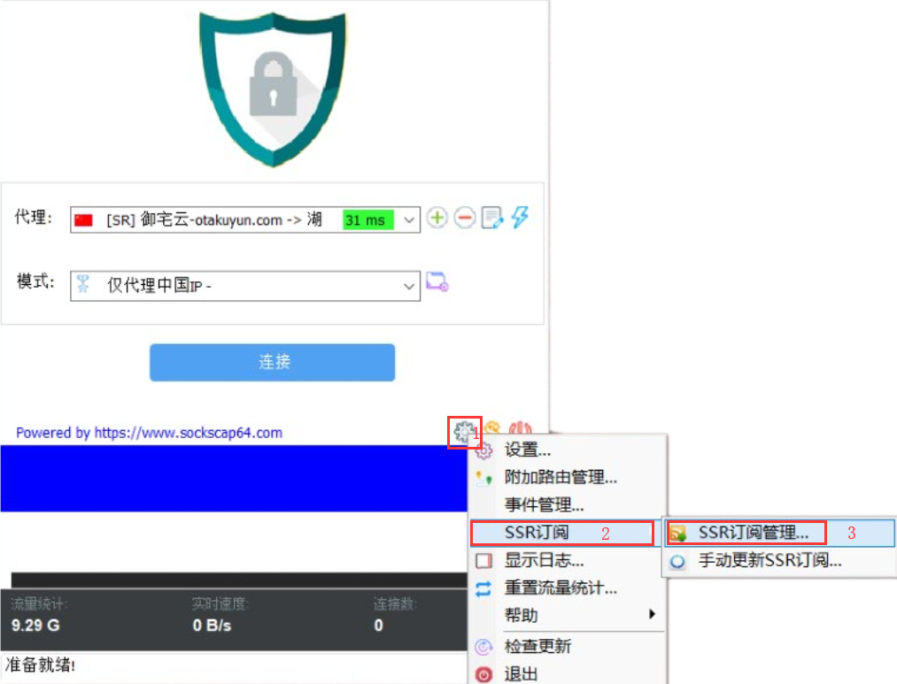
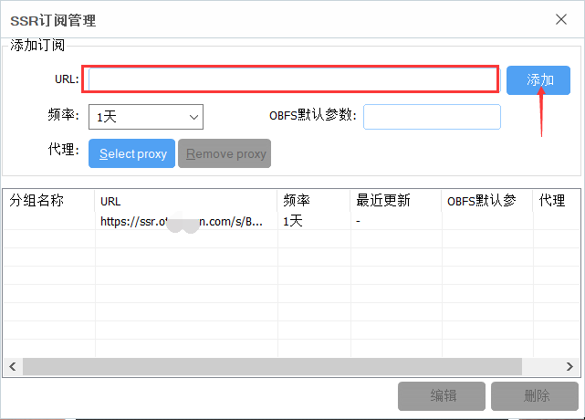

# 游戏版

## 1.信息/要求

* 系统要求：`Windows XP 及更新版本`
* 软件版本：`SSTAP 1.1.0.1加强版`
* 设备要求：`Windows 电脑 / 平板`

## 2. 客户端下载

[本地下载](https://github.com/ZBrettonYe/SSR-Client/releases/download/1.1/SSTAP.exe)​ \| [百度云](https://pan.baidu.com/s/1dRxCM_0KCr3pJP5iWNDsvA)​

## 3. 添加节点


请选择多其中一个设置方式设置即可！

  
进行此步骤前，您需要知道如何获取 **节点信息**​




### 3.1 订阅链接

1. 点击设置按钮-`SSR订阅`-`SSR订阅管理`；

   

2. 在输入框中输入订阅链接并确定

   

### 3.2 单节点代码设置

点击`+`号-点击通过`SS/SSR链接批量添加代理`，最后将节点代码粘贴进输入框

## 4. 启动代理

选择节点，选择模式 后 点击连接。

  

